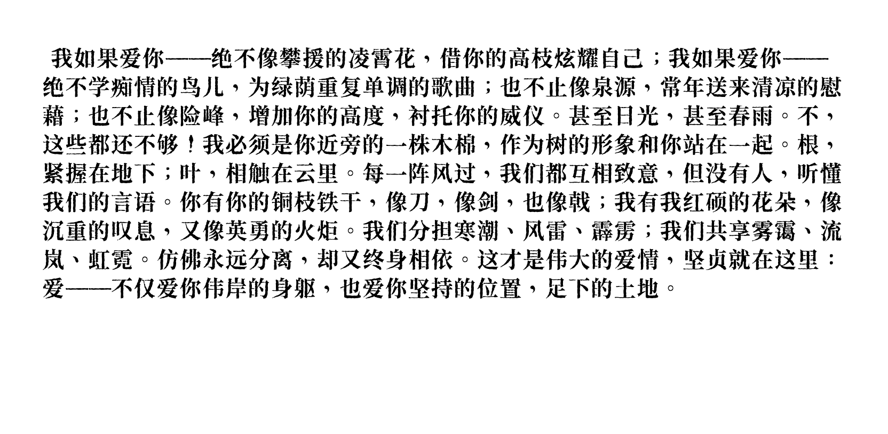
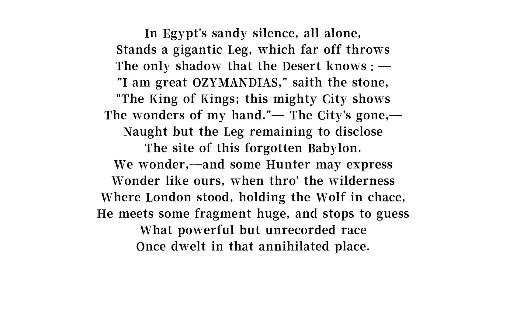
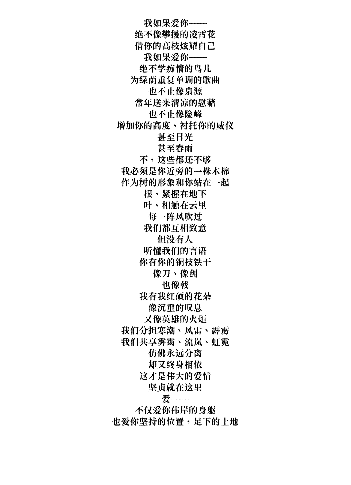
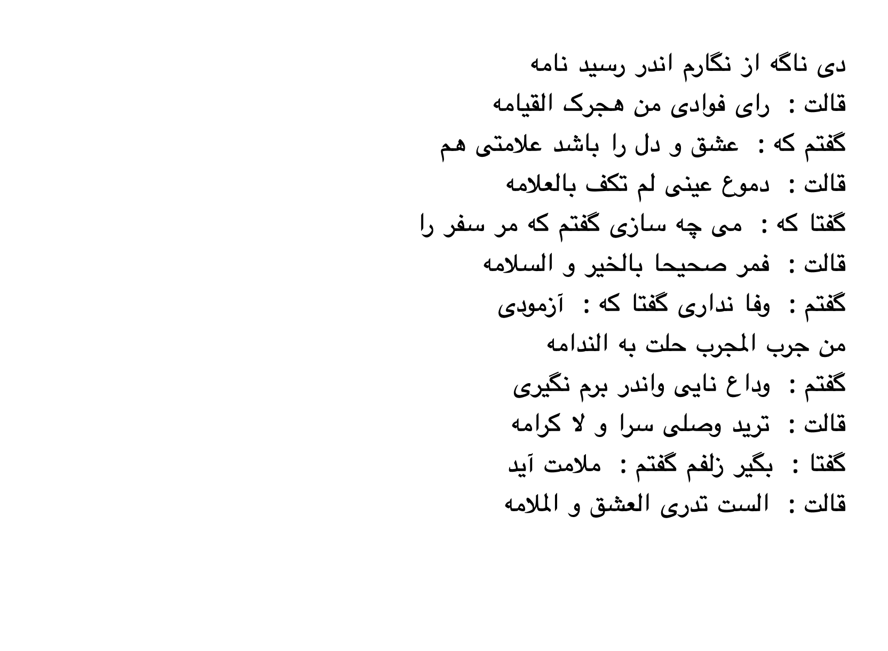
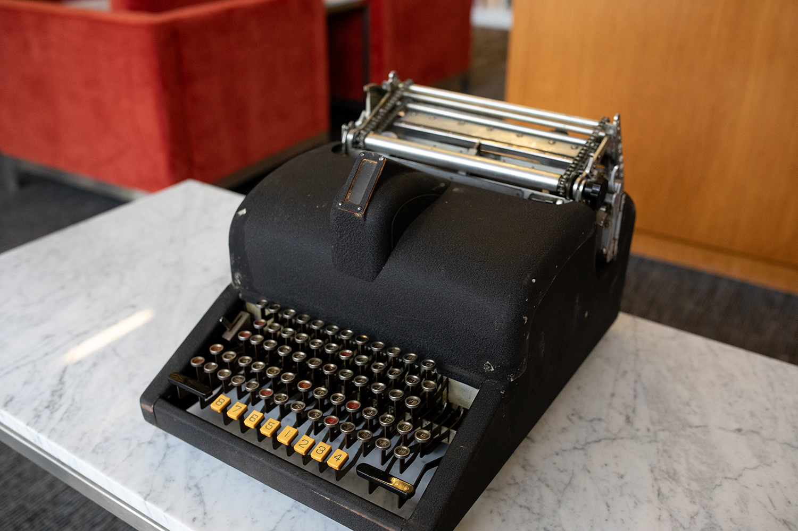

# Mingkwai-Typewriter

A desktop application that imitates [Monotype](https://monotype.app/) typewriter, supports more than just English
characters, screenshot
export, etc.

<kbd>
  
</kbd>
 

## Feature

- Generate images with text
- Typing sounds with typing
- Text alignment
- Text size/font adjustment
- Typing preview statistics

## Overview

### Export/Printed images.

<table>
  <tr>
      <td>
        
        
Align.Left with Chinese

      </td>
      <td>
        
        
Align.Center with Engligsh

      </td>
  </tr>
  <tr>
     <td>
        
        
Align.Center with Chinese

     </td>
     <td>
        
        
Align.Right with Arabic

     </td>
  </tr>
</table>

## Run

Run the desktop application: `./gradlew :composeApp:run`

## Todo!

Initially, I wanner use the following image as a prototype for the UI, but I found it hard to do so, mainly due to the
UI design.

</td>

see more in this
article [MingKwai prototype, the ‘origin of Chinese computing,’ finds a home at Stanford](https://news.stanford.edu/stories/2025/05/mingkwai-chinese-typewriter-prototype-stanford-libraries)

## Other

This is a Kotlin Multiplatform project targeting Desktop (JVM).